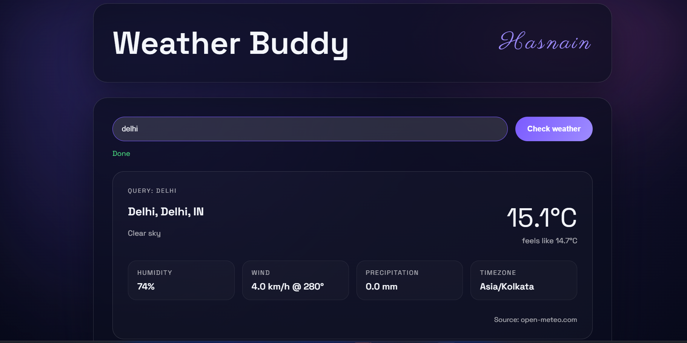

# Weatheragentic



## Why this stack?

- **Open-Meteo data** – Free, no-key APIs with globally consistent geocoding + forecasts.
- **Smart caching** – Location lookups and current conditions are cached (configurable TTLs) to keep repeat queries snappy.
- **Flask + handcrafted UI** – A minimal Python backend serving a modern glassmorphism-inspired interface with Space Grotesk + Inter fonts.

## Prerequisites

1. Python 3.10+ with `conda` or `venv` access.
2. An internet connection (Open-Meteo has no auth keys).

## Setup

```pwsh
cd "c:/Users/4236h/Ai Agents/weather_agent"
pip install -r requirements.txt
```

Environment variables (optional):

| Variable | Purpose | Default |
| --- | --- | --- |
| `WEATHER_APP_HOST` | Flask bind host | `127.0.0.1` |
| `WEATHER_APP_PORT` | Flask port | `5000` |
| `WEATHER_API_BASE_URL` | Open-Meteo forecast endpoint override | `https://api.open-meteo.com/v1/forecast` |
| `WEATHER_GEOCODE_BASE_URL` | Open-Meteo geocoding endpoint override | `https://geocoding-api.open-meteo.com/v1/search` |
| `WEATHER_API_TIMEOUT` | Seconds to wait for Open-Meteo calls | `10` |
| `WEATHER_GEOCODE_CACHE_TTL` | Seconds to cache location-to-coordinate lookups | `86400` (24h) |
| `WEATHER_CURRENT_CACHE_TTL` | Seconds to cache current weather responses | `300` (5 min) |

Put them in a `.env` file or export them before running the agent.

Set either cache TTL to `0` to disable caching entirely (useful for debugging or when you need truly fresh hits every time).

## Run the GUI

```pwsh
python main.py
```

Then open <http://127.0.0.1:5000> (or whatever host/port you configured). Type a location, hit **Check weather**, and watch the card animate in with the latest conditions.

### API endpoint

The frontend uses a simple JSON API you can also script against:

```http
POST /api/weather
Content-Type: application/json

{ "location": "Lisbon" }
```

Responses look like:

```json
{
   "location": "srinagar, kashmir,",
   "query": "srinagar",
   "temperature": "19.2°C",
   "feels_like": "19.0°C",
   "humidity": "68%",
   "wind_speed": "12.3 km/h",
   "wind_direction": "240°",
   "precipitation": "0.0 mm",
   "timezone": "newdelhi",
   "condition": "Partly cloudy",
   "source": "open-meteo.com"
}
```

## Tests

The weather tool has unit tests that mock the HTTP calls, so you can validate behavior without touching the real API:

```pwsh
python -m unittest test_tools.py
```

## Next steps

- Deploy the Flask app behind a CDN (Render, Azure App Service, Fly.io, etc.).
- Add hourly or daily forecast panes using additional Open-Meteo fields.
- Package the `/api/weather` endpoint for other agents or chatbots to consume.
